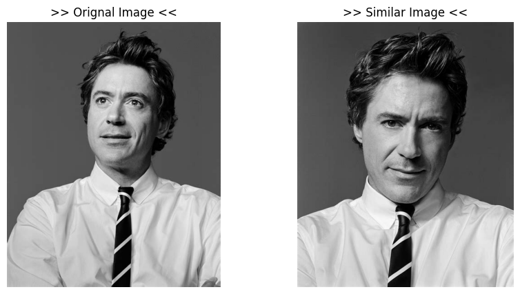
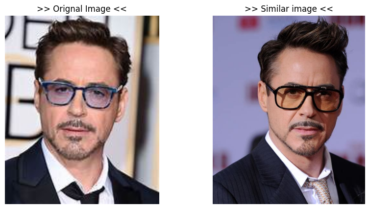

# Optimized Image Similarity Search and Duplicate Removal

# Overview  
This project is an efficient and scalable solution for finding similar images and detecting duplicates within large datasets using Locality-Sensitive Hashing (LSH) and Bloom Filter techniques. The project is designed to handle large-scale image data, leveraging the power of PySpark for distributed data processing. The focus is on celebrity image datasets, with algorithms optimized for high performance and scalability.

### Features
• **Image Similarity Detection**: Utilizes the LSH algorithm to find similar images based on their hash values, efficiently grouping visually similar content.

• **Duplicate Detection**: Implements Bloom Filter to identify and remove duplicate images from the dataset.

• **Large Dataset Processing**: Efficiently handles and processes large datasets using PySpark's distributed computing capabilities. Optimized Data Workflows: Optimizes data pipelines for faster image processing and similarity detection.

• **Result Visualization**: Visualizes results and performance insights through plots and graphs using Matplotlib.

### Technologies Used
• **Python**: Core language used for implementing the logic and processing workflows.

• **PySpark**: Employed for large-scale, distributed processing of the image dataset.

• **Locality-Sensitive Hashing (LSH)**: Key algorithm used for identifying similar images based on hash values.

• **Bloom Filter**: Technique applied to detect and remove duplicate images.

### Demo Results
Here are some examples of the results generated by the system:

